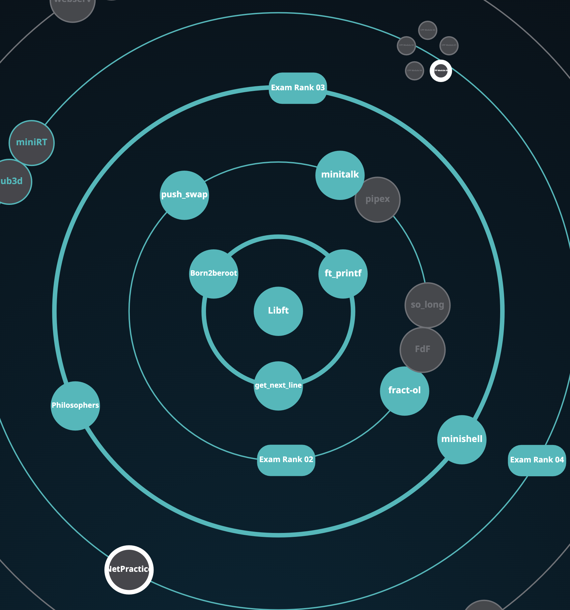
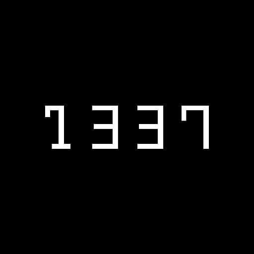

# 42_Cursus
42 School Cursus

__________________________________

<1337 Future Is Loading />

# 42 Projects

<h2> <a href="./Libft">Libft                </a></h2>
<h2> <a href="./ft_printf">Ft_printf        </a></h2>
<h2> <a href="./Get_next_line">Get_next_line</a></h2>
<h2> <a href="https://github.com/wmBolles/42_Cursus/tree/main/b2r_scripts">Born2beroot</a></h2>
<h2> <a href="./Minitalk">Minitalk          </a></h2>
<h2> <a href="https://github.com/wmBolles/42-Fract-Ol">Fract-ol          </a></h2>
<h2> <a href="./Push_swap/">Push_swap          </a></h2>
<h2> <a href="https://github.com/Philosophers/philo/">Philosophers          </a></h2>
<h2> <a href="./Minishell/">Minishell          </a></h2>

__________________________________

# 42 Exams

<h2> <a href="./42-Exams/Exam-Rank-02/">Exam-rank-02</a></h2>
<h2> <a href="./42-Exams/Exam-Rank-04/">Exam-rank-04</a></h2>

__________________________________

Created by wabolles
